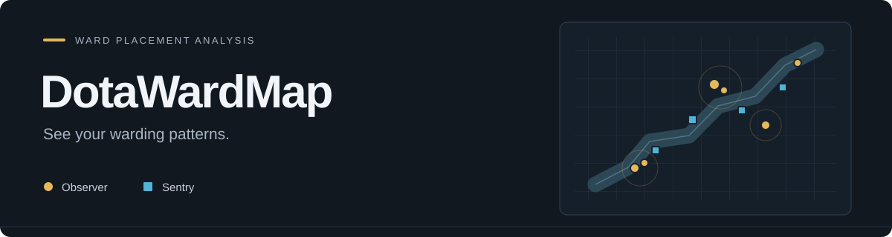
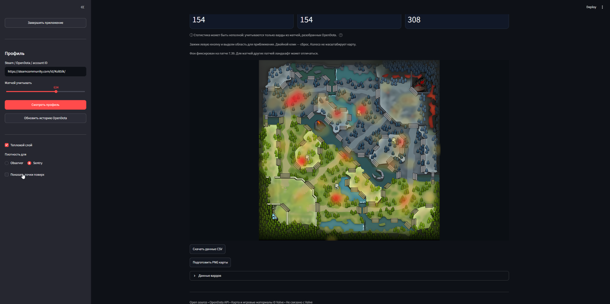
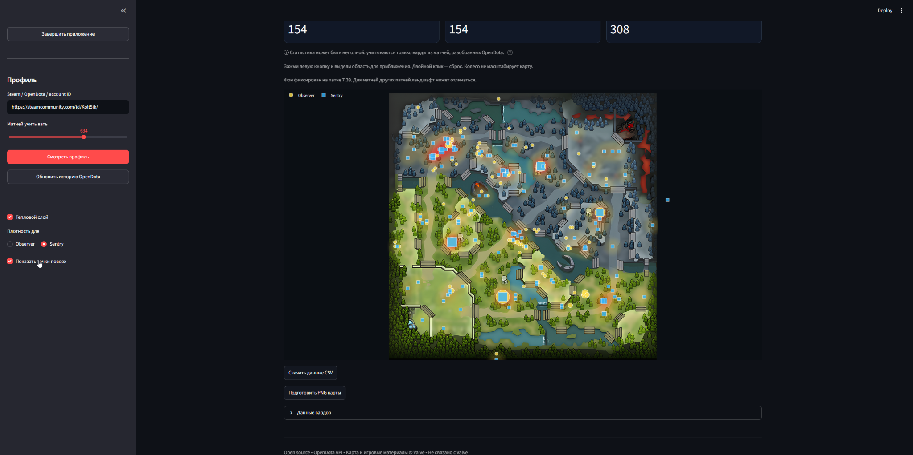

<p align="center">
  
</p>

<p align="center">
  <strong>Твои варды. Твои привычки. Одна карта.</strong><br>
  Анализируй доступные установки Observer и Sentry, находи частые позиции<br>
  и сохраняй результат для разбора с командой.
</p>

<p align="center">
  <a href="https://github.com/Kolt5ik/DotaWardMap/releases/latest"></a>
  <a href="https://github.com/Kolt5ik/DotaWardMap/actions/workflows/build-windows.yml"></a>
  <a href="LICENSE"></a>
</p>

<p align="center">
  <a href="https://github.com/Kolt5ik/DotaWardMap/releases/latest/download/DotaWardMap.exe"></a>
</p>

<p align="center">
  <a href="#быстрый-старт">Быстрый старт</a> ·
  <a href="#возможности">Возможности</a> ·
  <a href="#документация">Документация</a> ·
  <a href="https://github.com/Kolt5ik/DotaWardMap/issues/new/choose">Сообщить об ошибке</a> ·
  <a href="README.en.md">English</a>
</p>

## Посмотри, как выглядит приложение

<p align="center">
  
</p>

<p align="center"><sub>Анимированный обзор двух реальных скриншотов v9.0.4: плотность Sentry → точки Observer/Sentry поверх слоя.</sub></p>

**DotaWardMap** собирает доступные позиции вардов игрока на интерактивной карте. Вставь Steam-профиль, выбери число последних матчей и переключайся между точными позициями и плавной плотностью.

Интерфейс открывается в браузере на твоём компьютере. **Steam и Dota 2 устанавливать не требуется.** Windows EXE включает Python и зависимости.

> Данные OpenDota могут быть неполными: выбранный лимит матчей не гарантирует координаты из каждой игры. Подложка фиксирована на **7.39**.

## Возможности

<table>
<tr>
<td width="50%" valign="top">
<h3>🟡 Узнай свои привычные позиции</h3>
<p>Observer и Sentry на одной карте. Повторные установки объединяются; наведи курсор, чтобы узнать количество.</p>
</td>
<td width="50%" valign="top">
<h3>🔥 Найди места высокой плотности</h3>
<p>Плавные пятна объединяют соседние позиции. Выбирай плотность Observer или Sentry отдельно.</p>
</td>
</tr>
<tr>
<td width="50%" valign="top">
<h3>🔎 Рассмотри нужный участок</h3>
<p>Выдели область мышью для приближения. Двойной клик сбрасывает масштаб; колесо прокручивает страницу.</p>
</td>
<td width="50%" valign="top">
<h3>📤 Сохрани результат разбора</h3>
<p>Выгружай агрегированные координаты в CSV или карту с выбранными слоями в PNG, если экспорт доступен.</p>
</td>
</tr>
</table>

### Плавная тепловая карта



Частые позиции выделяются ярче, а в местах с низкой плотностью слой остаётся прозрачным. Цвет показывает относительную частоту установок выбранного типа, а не радиус обзора или качество варда.

### Точные позиции поверх плотности



Включи **«Показать точки поверх»**, чтобы проверить конкретные координаты. Жёлтые круги — Observer, голубые квадраты — Sentry. Поверх выбранной плотности отображаются оба типа маркеров.

Сними галочку **«Тепловой слой»**, чтобы вернуться к обычным точкам, фильтрам типов и настройкам размера/непрозрачности.

### Всё необходимое для начала

| Возможность | В приложении |
| --- | --- |
| Загрузка профиля | Steam URL, custom `/id/…`, SteamID64, account ID или OpenDota URL |
| Объём запроса | Последние 1–1000 матчей; по умолчанию 100 |
| Типы вардов | Observer и Sentry; плотности не смешиваются |
| Обновление истории | Запрос обновления OpenDota и очистка локального кеша API |
| Экспорт | CSV всего загруженного набора, PNG выбранных слоёв при доступном экспорте |
| Завершение EXE | Кнопка, которая останавливает локальный сервер |

## Быстрый старт

### Windows — три шага

1. **Скачай** [DotaWardMap.exe](https://github.com/Kolt5ik/DotaWardMap/releases/latest/download/DotaWardMap.exe) из последнего релиза.
2. **Запусти EXE.** Откроется браузер; если нет, перейди на [127.0.0.1:8501](http://127.0.0.1:8501).
3. **Вставь ссылку профиля**, выбери число матчей и нажми **«Смотреть профиль»**.

После работы нажми **«Завершить приложение»**. Закрытие вкладки само по себе не останавливает сервер. Перед запуском новой версии заверши старую.

### Из исходников

Python **3.12** используется в Windows-сборке. Скачай [исходники](https://github.com/Kolt5ik/DotaWardMap/archive/refs/heads/main.zip) и открой терминал в папке с `app.py` и `requirements.txt`.

<details>
<summary><strong>Windows / PowerShell</strong></summary>

```powershell
python -m venv .venv
.\.venv\Scripts\python.exe -m pip install -r requirements.txt
.\.venv\Scripts\python.exe -m streamlit run app.py --server.address=127.0.0.1 --browser.gatherUsageStats=false
```

</details>

<details>
<summary><strong>Linux / macOS</strong></summary>

```bash
python3 -m venv .venv
.venv/bin/python -m pip install -r requirements.txt
.venv/bin/python -m streamlit run app.py --server.address=127.0.0.1 --browser.gatherUsageStats=false
```

</details>

Активация окружения не нужна. Оставь терминал открытым; **Ctrl+C** завершает сервер. [Установка, повторный запуск и сборка EXE →](docs/installation.md)

## Документация

| Для игрока | Для разработчика |
| --- | --- |
| [Руководство пользователя](docs/usage.md) — профиль, слои и экспорт | [Устройство проекта](docs/architecture.md) — файлы, функции и состояние |
| [Установка](docs/installation.md) — EXE и исходники | [Данные и расчёт плотности](docs/data.md) — API, координаты и формулы |
| [Решение проблем](docs/troubleshooting.md) — пустая карта и ошибки | [Участие в проекте](CONTRIBUTING.md) — ветки, проверки и PR |
| [FAQ](docs/faq.md) — короткие ответы | [Демонстрация](docs/demo.md) — учебный набор и сценарий показа |

Хочешь попробовать карту без установки? Есть [автономное интерактивное демо](docs/interactive-demo.html) на учебных данных. Скачай HTML через **Download raw file** и открой браузером. Полный Streamlit-интерфейс на том же наборе запускается через `demo_app.py`; подробности — в руководстве демонстрации.

## Что важно знать о данных

- Источник — агрегированный `wardmap` OpenDota. Варды из неразобранных реплеев могут отсутствовать.
- Обновление истории выполняется асинхронно и не гарантирует разбор всех реплеев.
- Цветовая шкала нормализуется для каждого результата; одинаковые цвета разных карт не означают равные количества.
- Подложка **7.39** может отличаться от ландшафта другого патча. Точная привязка всех объектов по реальным реплеям не проверена.
- Индивидуальный выбор матчей, фильтры героя/даты и время установки в текущем интерфейсе отсутствуют.
- Запрос включает обычные и нестандартные матчи. CSV содержит оба типа независимо от фильтров отображения.
- Приближение в браузере не передаётся в PNG; для приближённого участка используй снимок экрана. При недоступном PNG остаются карта и CSV.

[Как формируются данные и что означает результат →](docs/data.md)

## Помоги сделать проект лучше

Нашёл ошибку или придумал улучшение? [Открой issue](https://github.com/Kolt5ik/DotaWardMap/issues/new/choose). Укажи версию, шаги воспроизведения и точный текст ошибки.

Принимаются исправления, переводы и улучшения документации. Изменения проходят через отдельную ветку и pull request. [Как участвовать →](CONTRIBUTING.md)

Если DotaWardMap помог в разборе — поделись проектом с командой.

## Лицензия и благодарности

Код и документация — [MIT License](LICENSE). Карта и игровые материалы © **Valve**; MIT на них не распространяется. [Источник и обработка подложки](assets/README.md). На обложке — схематичные позиции; скриншоты показывают реальное приложение.

Спасибо [OpenDota](https://www.opendota.com/) за данные, [Streamlit](https://streamlit.io/) и [Plotly](https://plotly.com/python/) за инструменты. Проект вдохновлён [DOTAWardFinder](https://github.com/NadimKawwa/DOTAWardFinder).

<p align="center"><sub>Создан <a href="https://github.com/Kolt5ik">Kolt5ik</a> · Независимый community tool · Не связан с Valve или OpenDota</sub></p>
